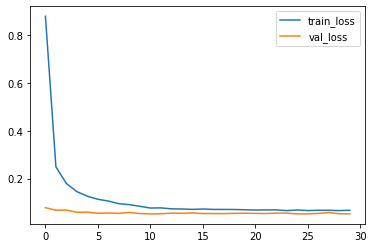
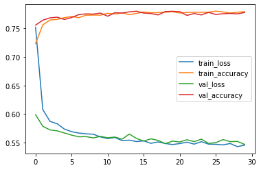
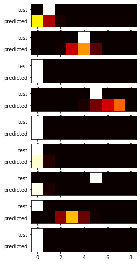

# project_steam

# Copyright 2022 Sang Wook KIm

Licensed under the Apache License, Version 2.0 (the "License");
you may not use this file except in compliance with the License.
You may obtain a copy of the License at

    http://www.apache.org/licenses/LICENSE-2.0

Unless required by applicable law or agreed to in writing, software
distributed under the License is distributed on an "AS IS" BASIS,
WITHOUT WARRANTIES OR CONDITIONS OF ANY KIND, either express or implied.
See the License for the specific language governing permissions and
limitations under the License.

### Data source (Steam Store Games): https://www.kaggle.com/nikdavis/steam-store-games?select=steam_media_data.csv

# 1. Insights and data preperation
## label : bucketized number of owners
## features
highly informative: 'categories', 'genres', 'steamspy_tags', 'positive_ratings', 'negative_ratings', 'price'

less informative: 'english', 'platforms', 'required_age','achievements'

bias risk: 'release_date', 'developer', 'publisher'

## questions:

1. "Is the release_date related to # of owners?"

2. "Does developer or publisher independently affect # of owners?" - Credit? PR?

3. What features should be used for training?

|owners    |release_date_format   |counts|
|----------|----------------------|------|			
|20        |2017-09-12T03:23:00	  |18596 |
|50        |2016-03-05T19:40:01	  |3059  |
|100       |2015-10-14T22:45:07	  |1695  |
|200       |2015-05-23T05:36:47	  |1386  |
|500       |2014-11-02T18:18:37	  |1272  |
|1000      |2014-02-20T23:51:06	  |513   |
|2000      |2013-10-17T09:29:10	  |288   |
|5000      |2013-09-19T21:57:49	  |193   |
|10000     |2011-12-31T10:50:52	  |46    |
|20000     |2011-01-29T10:51:25	  |21    |
|50000     |2012-11-02T08:00:00	  |3     |
|100000    |2015-04-22T00:30:00	  |2     |
|200000    |2013-07-09T00:00:00	  |1     |

## Answer for Q1:
The more owners, the older the average release date.

# 2. Data preperation
 * In the previous section, we found there are not many games with >10000K owners
 * Our label then can be either numeric or categorical.
 * Details in the jupyter notebook

# 3. Build model
## 1. Regression model

|label       |   predicted
|------------|--------------
|1.497866    |  1.539184
|1.497866    |  1.511131
|2.302585    |  1.530765
|1.497866    |  1.910407
|1.497866    |  2.170977
|1.497866    |  1.509650
|1.497866    |  1.512511
|1.497866    |  1.668842
|1.956012    |  1.588424
|1.497866    |  1.557009
|1.497866    |  2.754667
|1.956012    |  1.511754
|1.497866    |  2.695741
|1.497866    |  1.554533
|1.497866    |  2.692650
|1.497866    |  1.528315
|1.497866    |  1.547084
|1.956012    |  1.487020
|1.497866    |  1.559429
|1.497866    |  1.505943

## 2. Classification model

# Conclusion
## 1. Regression model:
### test mean_squared_error: 0.0528 for 2707 test samples

## 2. Classification model:
### test loss: 0.5400 test accuracy: 0.7872
